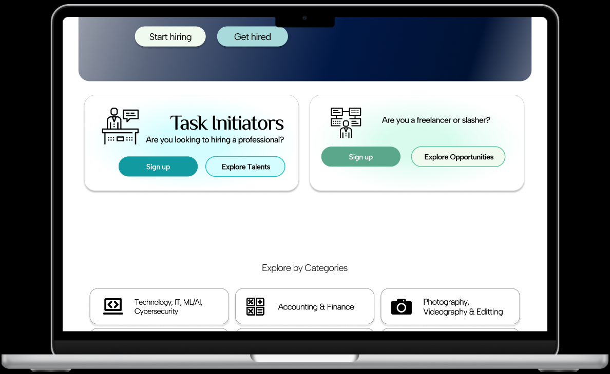

<h1 align="center">CaterCrue: The Ultimate Event Coordination and Food-Service Platform</h1>

## Table of Contents
- [Introduction](#introduction)
- [Technical Architecture Diagram](#technical-architecture-diagram)
- [Tech Stack](#tech-stack)

<!-- About the Project -->
## Introduction
CaterCrue is your all-in-one mobile app designed to revolutionize the way events are planned and executed. Our mission is to streamline every stage of the event coordination process, offering event coordinators a comprehensive toolkit to handle booking, scheduling, recruiting, execution, and post-event analysis effortlessly.

With CaterCrue, event professionals can manage their events from start to finish with intuitive features and real-time updates. Our platform provides seamless integration for scheduling tasks, coordinating with vendors, and ensuring smooth execution on the big day.

In addition, CaterCrue serves as a dedicated marketplace for food-service industry workers, helping them find contract work arrangements that fit their skills and availability. Whether you're a chef, server, or catering professional, our app connects you with opportunities that match your expertise and schedule.

Discover the power of streamlined event management and contract work opportunities with CaterCrue—where efficiency meets opportunity in the world of events.
 
## Technical Architecture Diagram
The CaterCrue platform is built on a distributed microservices architecture designed for scalability, reliability, and modular deployment. It uses a combination of REST and gRPC APIs behind an API Gateway, integrates with PostgreSQL and NoSQL databases, and supports real-time messaging through Kafka and WebSockets.

## Tech Stack
- **Frontend**: Next.js, Redux, Styled-Components, Storybook
- **Backend**: Node.js, Express, GraphQL, Passport (Oauth2, JWT)
- **Database**: Postgres, MongoDB, Elasticsearch, Redis
- **Messaging & Notifications**: WebSockets, Kafka
- **DevOps**: AWS (CodePipeline, EC2, S3, CloudFront), Terraform, Ansible, Jenkins, Docker, Kubernetes
